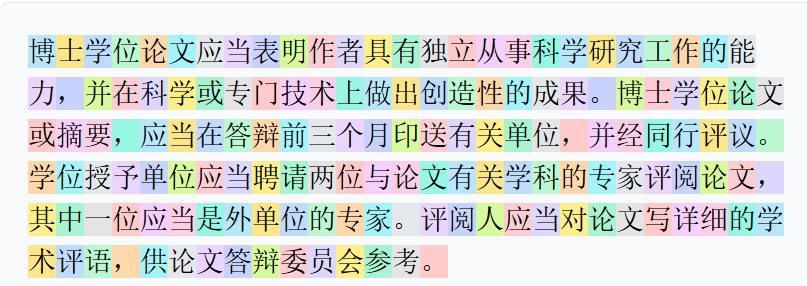
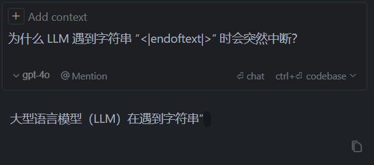
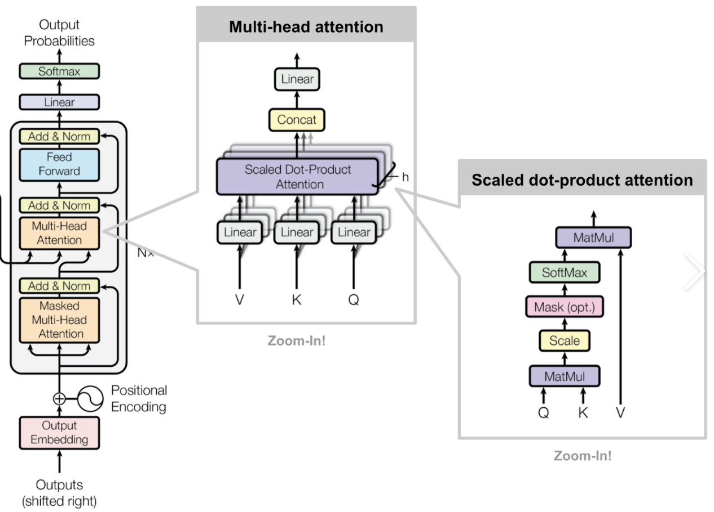
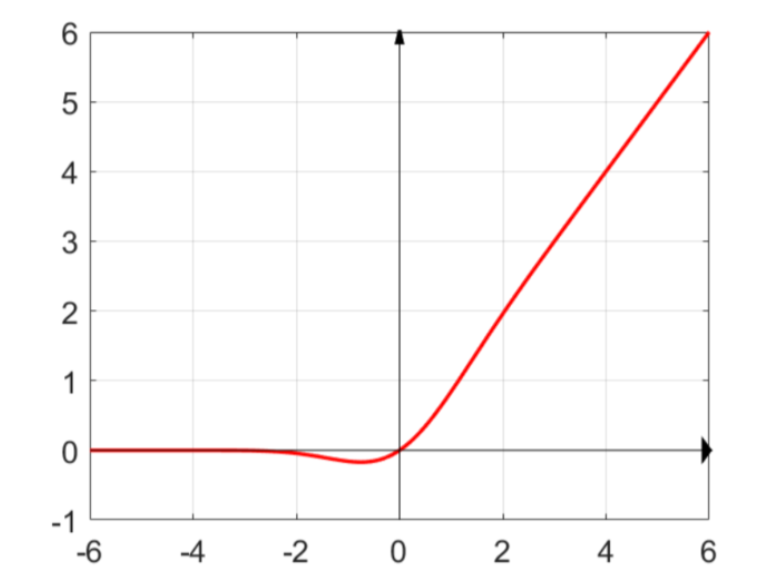
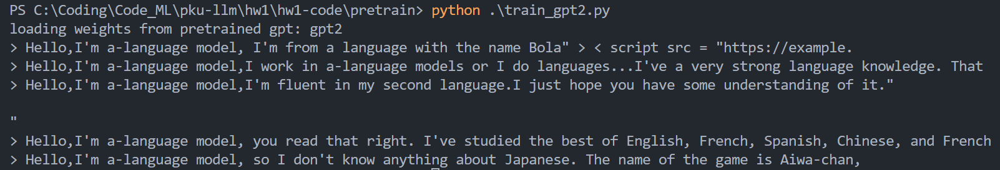
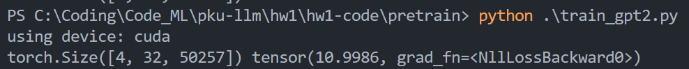
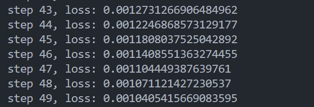

# 作业一：LLM实现与微调

## Tokenization

### 实现BPE，训练Tokenizer

**BPE（Byte Pair Encoding）算法介绍**

- 是一种基于Subword（子词）的算法，其**分词粒度处于单词级别和字符级别之间**，能在降低词表大小的同时也能学到词的语意信息。其目标是找到一种最优的字符组合方式，使得整个数据集中不同单词的字符组合尽可能的少。

 **BPE流程**

- 词表构建
    - **初始化**：将训练语料中的每个字符视为一个独立的符号（例如utf-8编码），构建初始词表。
    - **统计频率**：计算所有相邻字符对（例如：utf-8编码的字节对）的出现频率。
    - **合并操作**：选择出现频率最高的字符对，将其合并为一个新的符号，并更新词表。
    - **重复**：重复统计频率和合并操作，直到达到预定的词表大小或没有更多的字符对可以合并。

- 语料编码
    - **替换符号**：使用构建好的词表，将输入文本中的字符对替换为词表中的符号。
    - **生成子词**：通过不断替换，最终将文本编码为一系列的子词或符号，形成最终的编码结果。

- 解码
    - **反向映射**：根据词表，将编码后的子词或符号映射回原始字符。
    - **重构文本**：将所有的子词连接起来，重构出原始文本。


**实现一个基于BPE算法的tokenizer**

- 工具函数

    - ```Python
        def get_stats(ids:List[int], counts:Dict[Tuple[int, int], int]=None) -> Dict[Tuple[int, int], int]:
            """
            给出一个字节列表，返回相邻 字节对 的出现次数,允许传入一个counts字典，用于累加计数
            Params:
                ids (List[int]): 字节列表
                counts (Dict[Tuple[int, int], int]): 相邻字符对及其出现频率的字典
            Return:
                counts (Dict[Tuple[int, int], int]): 相邻字符对及其出现频率的字典
            Example: 
                ids=[1, 2, 3, 1, 2] -> {(1, 2): 2, (2, 3): 1, (3, 1): 1}
            """
        ```

    - ```Python
        def merge(ids:List[int], pair:Tuple[int, int], idx:int) -> List[int]:
            """
            合并所有连续出现的pair为新的token:idx，返回新的字节列表
            Params:
                ids (List[int]): 字节列表
                pair (Tuple[int, int]): 待合并的字符对
                idx (int): 新的token
            Return:
                newids (List[int]): 合并后的字节列表
            Example: 
                ids=[1, 2, 3, 1, 2], pair=(1, 2), idx=4 -> [4, 3, 4]
            """
        ```

- tokenizer类的部分重要方法

    - ```Python
        def _build_vocab(self):
                # 不断合并相邻子词，构建词表
                vocab = {idx: bytes([idx]) for idx in range(256)}
                for (p0, p1), idx in self.merges.items():
                    vocab[idx] = vocab[p0] + vocab[p1]
                for special, idx in self.special_tokens.items():
                    vocab[idx] = special.encode("utf-8")
                return vocab
        ```

    - ```Python
        def encode(self, text:str)->List[int]:
                # 给定一个字符串，返回一个token列表
                text_bytes = text.encode("utf-8") # 编码为原始字节
                ids = list(text_bytes) # 整数列表，每个整数取值为0-255（对应一个字节）
                while len(ids) >= 2:
                    # 找到合并索引值最低的字符对
                    # (由于构建词表时merge有先后顺序,encode时也要按照对应顺序合并，先合并索引值低的pair）
                    stats = get_stats(ids)
                    pair = min(stats, key=lambda p: self.merges.get(p, float("inf")))
                    # 微妙之处：如果没有更多的合并可用，键将导致每个字符对的值都是inf，min将返回一个inf
                    if pair not in self.merges:
                        break # 不再有其他可以合并的内容
                    # 否则合并最佳字符对（合并索引最低）
                    idx = self.merges[pair]
                    ids = merge(ids, pair, idx)
                return ids
        ```

    - ```Python
        def decode(self, ids:List[int])->str:
                # 给定一个token列表，返回一个字符串
                # 首先拼接所有token，然后解码为utf-8字符串
                text_bytes = b"".join(self.vocab[idx] for idx in ids)
                text = text_bytes.decode("utf-8", errors="replace")
                return text
        ```

    - ```Python
        def train(self, text, vocab_size, verbose=False):
                assert vocab_size >= 256
                # 初始词表为256，合并vocab_size - 256次后达到词表大小
                num_merges = vocab_size - 256
        
                # 输入文本预处理
                text_bytes = text.encode("utf-8") #编码为原始字节
                ids = list(text_bytes) # 整数列表，每个整数取值为0-255（对应一个字节）
        
                # 迭代地合并最常见的pair以创建新的token
                merges:Dict[Tuple[int, int], int] = {} # (int, int) -> int,合并字节对为新的token
                vocab:Dict[int, int] = {idx: bytes([idx]) for idx in range(256)} # int -> bytes, 词表
                for i in range(num_merges):
                    stats = get_stats(ids)
                    # 找到最常见的pair
                    pair = max(stats, key=stats.get)
                    # 新token的索引
                    idx = 256 + i
                    # 合并所有出现的pair为新的token
                    ids = merge(ids, pair, idx)
                    # 保存合并结果
                    merges[pair] = idx
                    # 更新词表，合并两个字节对象为一个新的字节对象
                    vocab[idx] = vocab[pair[0]] + vocab[pair[1]]
        ```

**训练tokenizer**

- 用它来encode再decode `manual.txt`，检查与原始`manual.txt`是否完全一致？
    - 结果完全一样

**对比GPT-2的tokenizer**

- 中文
    - 我的tokenizer encode产生的token长度为`118` ，token多为中文词语或者单个中文字符，例如：`'博士', '学位论文', '应当', '表', '明'`
    
    - GPT-2 tokenizer encode产生的token长度为`306` 。token基本全为单个汉字。下图是在tiktokenizer上的token划分，不同颜色代表不同的token：
    
        
    
- 英文
    - 我的tokenizer encode 产生的token长度为`942` ，且所有token为单个字母。
    - GPT-2 tokenizer encode 产生的token长度为`185` ，token一般为整个单词或者单词的一部分，例如：`'Orig', 'inated', ' the', ' Imperial', ' University'`
    
- 产生上述差别的原因：
    - 中文：GPT2的训练数据以英文为主，中文数据少，而我的 tokenizer 全为中文训练，且和测试字符串主题相似，有很多相同的词语，导致 我的 tokenizer 能够合并更多的子词，从而有更少的token长度和更多的词语或短语token。
    - 英文：相反，我的 tokenizer 中几乎没有英文，因此基本没有任何子词合并，字符串被分割为一个个单独的字母，导致产生的 token 非常多；而GPT2的训练数据以英文为主，能够很好地合并子词，token很少。


### 回答问题

- Python中使用什么函数查看字符的Unicode，什么函数将Unicode转换成字符？并使用它们查看“北”“大”的Unicode，查看Unicode为22823、27169、22411对应的字符。

    - `ord()`查看字符的Unicode，`chr()`将Unicode转换为对应的字符
    - 北：21271，大：22823
    - 22823：大、27169：模、22411：型

- Tokenizer的vocab size大和小分别有什么好处和坏处？

    - vocab大好处：
        -  **减少未登录词（OOV）**：较大的词汇表可以包含更多的单词和子词，减少未登录词的出现，从而提高模型对罕见词汇的处理能力。
        - **更好的语义表示**：由于词汇表中包含更多完整的单词，模型可以更好地捕捉词汇的语义信息。

    - vocab大坏处：
        - **计算资源消耗**：较大的词汇表会增加模型的参数数量，导致更高的内存和计算资源消耗。
        - **训练时间增加**：由于参数增多，训练时间可能会显著增加。
        - **过拟合风险**：较大的词汇表可能导致模型过拟合于训练数据，尤其是在数据量不足的情况下。
    - vocab小好处：
        - **计算效率高**：较小的词汇表减少了模型的参数数量，从而降低了内存和计算资源的需求，提高了计算效率。
        - **训练速度快**：由于参数较少，模型训练速度更快。
        - **泛化能力强**：较小的词汇表可能促使模型学习更通用的特征，增强泛化能力。
    - vocab小坏处：
        - **增加未登录词（OOV）**：较小的词汇表可能无法覆盖所有单词，导致未登录词的出现频率增加，影响模型的表现。
        - **语义信息丢失**：由于词汇表中可能缺少完整的单词，模型可能无法充分捕捉词汇的语义信息。

    

- 为什么 LLM 不能处理非常简单的字符串操作任务，比如反转字符串？

    - LLM通常**在词或子词级别进行训练和推理，而不是在字符级别**。所有的字符被组合成了 tokens，其中一些 token 很长，因此模型对单个字符的理解会较弱。

- 为什么 LLM 在非英语语言（例如日语）上表现较差？

    - 英语数据集大很多，最终会有更多英文的长词块。
- 其他语言则被分的很碎，消耗了更多的token，在transformer计算token之间的注意力时，会很消耗上下文长度。即从transformer角度，所有非英语的文本都被拉长了。
    - 如果翻译为英语，可大大减少token的消耗。

- 为什么 LLM 在简单算术问题上表现不好？

    - 数字被合并/划分为不同的token，数字可能被截断、重新合并，此外还有空格和标点的影响，导致模型不能学习到完整的数字含义。

- 为什么 GPT-2 在编写 Python 代码时遇到比预期更多的困难？

    - GPT-2 在处理 python 代码时，倾向于将每个空格划分为独立的 token，导致缩进中出现了大量冗余 token。导致文本过度膨胀。在transformer计算token之间的注意力时，过多的空格会将大量上下文浪费掉，而不能学习到真正有用到代码信息。

    - 而 GPT-4 使用的 cl100k_base 在处理 python 代码时，对缩进的处理更加智能。同时，GPT-4 划分出的 token 数量远小于 GPT-2。
    - 但 ==token 也不是越少越好，相当于要找到一个平衡点，信息足够密集但是又可以被划分开。==

- 为什么 LLM 遇到字符串 “<|endoftext|>” 时会突然中断？

    - e.g. 
    - `<|endoftext|>` 是一种特殊的token，用以给模型传递特殊信号，表示文本结束。因此LLM遇到该字符串时会突然中断。

- 为什么当问 LLM 关于 “SolidGoldMagikarp” 的问题时 LLM 会崩溃？

    - 参考文章 [SolidGoldMagikarp (plus, prompt generation)](https://www.lesswrong.com/posts/aPeJE8bSo6rAFoLqg/solidgoldmagikarp-plus-prompt-generation)。文中对 token 的嵌入做了聚类，然后发现了一些奇怪的 token 被聚集在了一起。这些 token 是从哪里来的，字面上看，它们毫无意义。有趣的是，如果你向模型输入包含这些 token 的 prompt，会得到混乱的回复。
    - 深入调查后，发现这个 SolidGoldMagikarp 其实是一名 reddit 用户。于是，可能是因为训练 tokenizer 的数据和训练语言模型的数据不同，而碰巧 tokenizer 的训练数据中包含了大量来自 reddit 的文本，然后 SolidGoldMagikarp 他发了很多帖子，或者被多次回复引用，然后被 BPE 算法学到了，合并成了一个 token。但是当训练语言模型的时候，并没有那部分 reddit 数据，于是这个 token 就不会被激活，它会被随机初始化，但是永远不会被采样到，也不会被更新，有点像未分配的内存。然后在推理的时候，你触发到了这个 token，那么就是采样到了未经初始化的嵌入，导致了未定义的行为。

    - 即：SolidGoldMagikarp用来测试LLM处理罕见或不常见输入时的表现，它被用作一种“边缘案例”来观察模型在面对不常见或无意义输入时的反应。这样的输入可能会导致模型生成不稳定或不连贯的输出，因为它们在训练数据中可能极为罕见或不存在。这种测试有助于揭示模型在处理异常输入时的鲁棒性和局限性。

- 为什么在使用 LLM 时应该更倾向于使用 YAML 而不是 JSON？

    - YAML 这种结构化文本在 GPT-4 上会消耗更少的 token，更加高效，更加经济。

- 为什么 LLM 实际上不是端到端的语言建模？

    - >  端到端：**模型可以直接利用输入数据而不需要其他处理**
       >
       > 典型的端到端模型 —— CNN，典型的非端到端模型——SVM

    - **预处理和后处理需求**：在使用LLM之前，通常需要对输入数据进行预处理（如分词、编码等），而输出结果也可能需要后处理（如解码、格式化）以适应特定的应用需求。

    - **外部知识和工具的依赖**：LLM在生成某些类型的内容时可能需要依赖外部知识库或工具。例如，处理特定领域的任务时，可能需要结合领域特定的知识或规则。

    - **有限的上下文窗口**：LLM的上下文窗口有限，无法处理非常长的文本或复杂的多文档任务，这需要额外的机制来分段处理和整合信息。

    - **缺乏交互和反馈机制**：端到端系统通常包括交互和反馈循环，以便在运行时调整和优化输出。LLM通常是一次性生成输出，缺乏动态调整的能力。


## LLM Implementation

所有commit截图：


### Section1

#### 完成GPT2所有类的实现

**transformer 结构实现**



- transformer 

    - 如上图所示，GPT2的transformer 和原transformer 相比去除了所有encoder，只保留decoder部分
    - 结构包括`token embedding. positional encoding, 多个隐藏层 ，layer normalization和最终的线性输出层 `
    - 最终的线性输出层禁用偏置：`self.lm_head = nn.Linear(config.n_embd, config.vocab_size, bias=False)`

- Block实现
    - Block是transformer 中的隐藏层。

    - 包括4层：两个LayerNorm：`ln_1, ln_2`，一层多头自注意力`attn `， 一层全连接:`mlp `

    - 前向传播过程如下，依次经过 `ln_1, attn, ln_2, mlp` , `attn 和mlp`后有残差连接

        ```python
        x = x + self.attn(self.ln_1(x))
        x = x + self.mlp(self.ln_2(x))
        ```

    - > 和原transformer 相比，GPT2 Block 其使用一个干净的残差连接，而不是残差中间经过一个Norm。
        >
        > - 注意力是聚合、池化、加权求和的过程
        > -  MLP是发生在每个单独的token上，token之间没有联系，是mapping操作 

- MLP实现
    - GPT2中的MLP是一个两层的全连接网络，中间有一个GELU激活函数

    - > gelu：类似RELU

        

        - 优点：0处光滑可导。
        - 优点：会贡献一个很小的梯度，便于优化
        - 有一个使用tanh近似的GELU激活函数（GPT2使用，现在没必要用）

    - 前向传播过程：

        ```python
        x = self.c_fc(x)
        x = self.gelu(x)
        x = self.c_proj(x)
        ```

- 多头自注意力CausalSelfAttention 过程包括：

    - 对一个batch的所有头计算query, key, value，并改变其形状
    - 计算注意力分数：$\text{Attention}(Q, K, V) = \text{softmax}\left(\frac{QK^T}{\sqrt{d_k}}\right)V$==(做softmax之前使用一个下三角矩阵来mask未来的信息)==
    - 将多头自注意力的输出合并并经过一个线性层得到输出

#### 实现GPT2的forward()，加载并测试GPT2

- `forward()`过程

    - 获得 `token embeddings` 和  `position embeddings`。
    - 将token嵌入向量和位置嵌入向量相加，得到最终的嵌入表示。
    - 在所有`Block`中进行前向传播
    - 使用`LayerNorm ` 归一化
    - 经过输出层，得到一个用对数表示的概率分布，表示下一个token的概率。

- 模型测试流程

    - 加载gpt2 模型，将其所有参数赋值给自定义模型
    - 使用tiktoken获得gpt2的编码器，编码需要扩写的句子为 x
    - 循环
        - 将上述 x 输入模型，得到形状为(B, T, vocab_size)的概率分布，获取最后一个token的概率分布。
        - 选择概率最大的前50个token
        - 从50个token中按照概率分布采样一个token
        - 将这个token加入到原来的序列中

- 结果

    

#### 自动检测GPU，加入tiny shakespeare数据集，batch划分，计算交叉熵损失

- 自动检测设备：`cuda` or `cpu`，使用`torch.cuda.is_available()`判断

- batch划分方法：

    - 使用`view()`将输入[0:-1]系列划分为(B, T) 形状
    - 同时创建标签y [1: ] 表示 next token pred

- 计算损失

    - 采用交叉熵损失，计算时要将向量展平为2D张量(B * T, vocab_size)

    - 

    - > 结果为`10.9986` 。每个token出现的概率为`1/50257` ，交叉熵取负对数，则为`-ln(1/50257) = 10.82`，证明**初始概率分布大致是均匀的**，可以开始训练模型

#### 对一个batch进行优化

- > ==优化器：SGD, Adam和 AdamW==
    >
    > - SGD（随机梯度下降）
    >     - **基本介绍**：每次迭代只使用一个样本（或一小批样本）来计算梯度，然后更新模型参数。这种方法可以减少计算量，但可能导致训练过程不稳定。
    >     - **优点**：计算效率高，易于实现。
    >     - **缺点**：收敛速度可能较慢，需要仔细调整学习率。
    > - Adam（自适应矩估计）
    >     - **基本介绍**：Adam是一种结合了动量（Momentum）和RMSprop（均方根传播）的优化算法。它通过计算梯度的一阶矩（均值）和二阶矩（方差）来调整每个参数的学习率。
    >     - **优点**：自适应调整学习率，通常收敛速度较快，对学习率的初始值不太敏感。
    >     - **缺点**：在一些情况下可能会遇到收敛问题，特别是在训练初期。
    > - AdamW（Adam with Weight Decay）
    >     - **基本介绍**：AdamW是Adam优化器的一个变种，它在Adam的基础上加入了权重衰减（Weight Decay），这是一种正则化技术，用于防止模型过拟合。
    >     - **优点**：结合了Adam的自适应学习率调整和权重衰减的正则化效果，通常在训练深度学习模型时表现更好。
    >     - **缺点**：与Adam相比，增加了额外的超参数，需要更多的调参工作。

- 循环优化

    - 每一轮调用`zero_grad()`清空梯度

    - `backward()`累计梯度, 

    - `step()`更新参数并减少损失

        > `loss.item()`将GPU的张量发送到CPU上，为float类型.
        >
        > ==`lr = 3e-4`: 一个对大多数优化器初期很好用的默认值==

    

### Section2


### Section3


## LoRA Fine-tuning