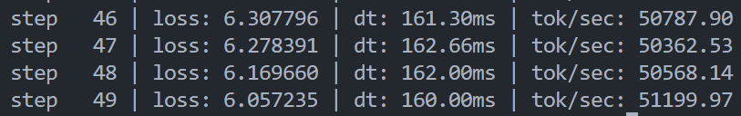

# 作业一：LLM实现与微调

## Tokenization

### 实现BPE，训练Tokenizer

**BPE（Byte Pair Encoding）算法介绍**

- 是一种基于Subword（子词）的算法，其**分词粒度处于单词级别和字符级别之间**，能在降低词表大小的同时也能学到词的语意信息。其目标是找到一种最优的字符组合方式，使得整个数据集中不同单词的字符组合尽可能的少。

 **BPE流程**

- 词表构建
    - **初始化**：将训练语料中的每个字符视为一个独立的符号（例如utf-8编码），构建初始词表。
    - **统计频率**：计算所有相邻字符对（例如：utf-8编码的字节对）的出现频率。
    - **合并操作**：选择出现频率最高的字符对，将其合并为一个新的符号，并更新词表。
    - **重复**：重复统计频率和合并操作，直到达到预定的词表大小或没有更多的字符对可以合并。

- 语料编码
    - **替换符号**：使用构建好的词表，将输入文本中的字符对替换为词表中的符号。
    - **生成子词**：通过不断替换，最终将文本编码为一系列的子词或符号，形成最终的编码结果。

- 解码
    - **反向映射**：根据词表，将编码后的子词或符号映射回原始字符。
    - **重构文本**：将所有的子词连接起来，重构出原始文本。


**实现一个基于BPE算法的tokenizer**

- 工具函数

    - ```Python
        def get_stats(ids:List[int], counts:Dict[Tuple[int, int], int]=None) -> Dict[Tuple[int, int], int]:
            """
            给出一个字节列表，返回相邻 字节对 的出现次数,允许传入一个counts字典，用于累加计数
            Params:
                ids (List[int]): 字节列表
                counts (Dict[Tuple[int, int], int]): 相邻字符对及其出现频率的字典
            Return:
                counts (Dict[Tuple[int, int], int]): 相邻字符对及其出现频率的字典
            Example: 
                ids=[1, 2, 3, 1, 2] -> {(1, 2): 2, (2, 3): 1, (3, 1): 1}
            """
        ```

    - ```Python
        def merge(ids:List[int], pair:Tuple[int, int], idx:int) -> List[int]:
            """
            合并所有连续出现的pair为新的token:idx，返回新的字节列表
            Params:
                ids (List[int]): 字节列表
                pair (Tuple[int, int]): 待合并的字符对
                idx (int): 新的token
            Return:
                newids (List[int]): 合并后的字节列表
            Example: 
                ids=[1, 2, 3, 1, 2], pair=(1, 2), idx=4 -> [4, 3, 4]
            """
        ```

- tokenizer类的部分重要方法

    - ```Python
        def _build_vocab(self):
                # 不断合并相邻子词，构建词表
                vocab = {idx: bytes([idx]) for idx in range(256)}
                for (p0, p1), idx in self.merges.items():
                    vocab[idx] = vocab[p0] + vocab[p1]
                for special, idx in self.special_tokens.items():
                    vocab[idx] = special.encode("utf-8")
                return vocab
        ```

    - ```Python
        def encode(self, text:str)->List[int]:
                # 给定一个字符串，返回一个token列表
                text_bytes = text.encode("utf-8") # 编码为原始字节
                ids = list(text_bytes) # 整数列表，每个整数取值为0-255（对应一个字节）
                while len(ids) >= 2:
                    # 找到合并索引值最低的字符对
                    # (由于构建词表时merge有先后顺序,encode时也要按照对应顺序合并，先合并索引值低的pair）
                    stats = get_stats(ids)
                    pair = min(stats, key=lambda p: self.merges.get(p, float("inf")))
                    # 微妙之处：如果没有更多的合并可用，键将导致每个字符对的值都是inf，min将返回一个inf
                    if pair not in self.merges:
                        break # 不再有其他可以合并的内容
                    # 否则合并最佳字符对（合并索引最低）
                    idx = self.merges[pair]
                    ids = merge(ids, pair, idx)
                return ids
        ```

    - ```Python
        def decode(self, ids:List[int])->str:
                # 给定一个token列表，返回一个字符串
                # 首先拼接所有token，然后解码为utf-8字符串
                text_bytes = b"".join(self.vocab[idx] for idx in ids)
                text = text_bytes.decode("utf-8", errors="replace")
                return text
        ```

    - ```Python
        def train(self, text, vocab_size, verbose=False):
                assert vocab_size >= 256
                # 初始词表为256，合并vocab_size - 256次后达到词表大小
                num_merges = vocab_size - 256
        
                # 输入文本预处理
                text_bytes = text.encode("utf-8") #编码为原始字节
                ids = list(text_bytes) # 整数列表，每个整数取值为0-255（对应一个字节）
        
                # 迭代地合并最常见的pair以创建新的token
                merges:Dict[Tuple[int, int], int] = {} # (int, int) -> int,合并字节对为新的token
                vocab:Dict[int, int] = {idx: bytes([idx]) for idx in range(256)} # int -> bytes, 词表
                for i in range(num_merges):
                    stats = get_stats(ids)
                    # 找到最常见的pair
                    pair = max(stats, key=stats.get)
                    # 新token的索引
                    idx = 256 + i
                    # 合并所有出现的pair为新的token
                    ids = merge(ids, pair, idx)
                    # 保存合并结果
                    merges[pair] = idx
                    # 更新词表，合并两个字节对象为一个新的字节对象
                    vocab[idx] = vocab[pair[0]] + vocab[pair[1]]
        ```

**训练tokenizer**

- 用它来encode再decode `manual.txt`，检查与原始`manual.txt`是否完全一致？
    - 结果完全一样

**对比GPT-2的tokenizer**

- 中文
    - 我的tokenizer encode产生的token长度为`118` ，token多为中文词语或者单个中文字符，例如：`'博士', '学位论文', '应当', '表', '明'`
    
    - GPT-2 tokenizer encode产生的token长度为`306` 。token基本全为单个汉字。下图是在tiktokenizer上的token划分，不同颜色代表不同的token：
    
        
    
- 英文
    - 我的tokenizer encode 产生的token长度为`942` ，且所有token为单个字母。
    - GPT-2 tokenizer encode 产生的token长度为`185` ，token一般为整个单词或者单词的一部分，例如：`'Orig', 'inated', ' the', ' Imperial', ' University'`
    
- 产生上述差别的原因：
    - 中文：GPT2的训练数据以英文为主，中文数据少，而我的 tokenizer 全为中文训练，且和测试字符串主题相似，有很多相同的词语，导致 我的 tokenizer 能够合并更多的子词，从而有更少的token长度和更多的词语或短语token。
    - 英文：相反，我的 tokenizer 中几乎没有英文，因此基本没有任何子词合并，字符串被分割为一个个单独的字母，导致产生的 token 非常多；而GPT2的训练数据以英文为主，能够很好地合并子词，token很少。


### 回答问题

- Python中使用什么函数查看字符的Unicode，什么函数将Unicode转换成字符？并使用它们查看“北”“大”的Unicode，查看Unicode为22823、27169、22411对应的字符。

    - `ord()`查看字符的Unicode，`chr()`将Unicode转换为对应的字符
    - 北：21271，大：22823
    - 22823：大、27169：模、22411：型

- Tokenizer的vocab size大和小分别有什么好处和坏处？

    - vocab大好处：
        -  **减少未登录词（OOV）**：较大的词汇表可以包含更多的单词和子词，减少未登录词的出现，从而提高模型对罕见词汇的处理能力。
        - **更好的语义表示**：由于词汇表中包含更多完整的单词，模型可以更好地捕捉词汇的语义信息。

    - vocab大坏处：
        - **计算资源消耗**：较大的词汇表会增加模型的参数数量，导致更高的内存和计算资源消耗。
        - **训练时间增加**：由于参数增多，训练时间可能会显著增加。
        - **过拟合风险**：较大的词汇表可能导致模型过拟合于训练数据，尤其是在数据量不足的情况下。
    - vocab小好处：
        - **计算效率高**：较小的词汇表减少了模型的参数数量，从而降低了内存和计算资源的需求，提高了计算效率。
        - **训练速度快**：由于参数较少，模型训练速度更快。
        - **泛化能力强**：较小的词汇表可能促使模型学习更通用的特征，增强泛化能力。
    - vocab小坏处：
        - **增加未登录词（OOV）**：较小的词汇表可能无法覆盖所有单词，导致未登录词的出现频率增加，影响模型的表现。
        - **语义信息丢失**：由于词汇表中可能缺少完整的单词，模型可能无法充分捕捉词汇的语义信息。

    

- 为什么 LLM 不能处理非常简单的字符串操作任务，比如反转字符串？

    - LLM通常**在词或子词级别进行训练和推理，而不是在字符级别**。所有的字符被组合成了 tokens，其中一些 token 很长，因此模型对单个字符的理解会较弱。

- 为什么 LLM 在非英语语言（例如日语）上表现较差？

    - 英语数据集大很多，最终会有更多英文的长词块。
- 其他语言则被分的很碎，消耗了更多的token，在transformer计算token之间的注意力时，会很消耗上下文长度。即从transformer角度，所有非英语的文本都被拉长了。
    - 如果翻译为英语，可大大减少token的消耗。

- 为什么 LLM 在简单算术问题上表现不好？

    - 数字被合并/划分为不同的token，数字可能被截断、重新合并，此外还有空格和标点的影响，导致模型不能学习到完整的数字含义。

- 为什么 GPT-2 在编写 Python 代码时遇到比预期更多的困难？

    - GPT-2 在处理 python 代码时，倾向于将每个空格划分为独立的 token，导致缩进中出现了大量冗余 token。导致文本过度膨胀。在transformer计算token之间的注意力时，过多的空格会将大量上下文浪费掉，而不能学习到真正有用到代码信息。

    - 而 GPT-4 使用的 cl100k_base 在处理 python 代码时，对缩进的处理更加智能。同时，GPT-4 划分出的 token 数量远小于 GPT-2。
    - 但 ==token 也不是越少越好，相当于要找到一个平衡点，信息足够密集但是又可以被划分开。==

- 为什么 LLM 遇到字符串 “<|endoftext|>” 时会突然中断？

    - e.g. 
    - `<|endoftext|>` 是一种特殊的token，用以给模型传递特殊信号，表示文本结束。因此LLM遇到该字符串时会突然中断。

- 为什么当问 LLM 关于 “SolidGoldMagikarp” 的问题时 LLM 会崩溃？

    - 参考文章 [SolidGoldMagikarp (plus, prompt generation)](https://www.lesswrong.com/posts/aPeJE8bSo6rAFoLqg/solidgoldmagikarp-plus-prompt-generation)。文中对 token 的嵌入做了聚类，然后发现了一些奇怪的 token 被聚集在了一起。这些 token 是从哪里来的，字面上看，它们毫无意义。有趣的是，如果你向模型输入包含这些 token 的 prompt，会得到混乱的回复。
    - 深入调查后，发现这个 SolidGoldMagikarp 其实是一名 reddit 用户。于是，可能是因为训练 tokenizer 的数据和训练语言模型的数据不同，而碰巧 tokenizer 的训练数据中包含了大量来自 reddit 的文本，然后 SolidGoldMagikarp 他发了很多帖子，或者被多次回复引用，然后被 BPE 算法学到了，合并成了一个 token。但是当训练语言模型的时候，并没有那部分 reddit 数据，于是这个 token 就不会被激活，它会被随机初始化，但是永远不会被采样到，也不会被更新，有点像未分配的内存。然后在推理的时候，你触发到了这个 token，那么就是采样到了未经初始化的嵌入，导致了未定义的行为。

    - 即：SolidGoldMagikarp用来测试LLM处理罕见或不常见输入时的表现，它被用作一种“边缘案例”来观察模型在面对不常见或无意义输入时的反应。这样的输入可能会导致模型生成不稳定或不连贯的输出，因为它们在训练数据中可能极为罕见或不存在。这种测试有助于揭示模型在处理异常输入时的鲁棒性和局限性。

- 为什么在使用 LLM 时应该更倾向于使用 YAML 而不是 JSON？

    - YAML 这种结构化文本在 GPT-4 上会消耗更少的 token，更加高效，更加经济。

- 为什么 LLM 实际上不是端到端的语言建模？

    - >  端到端：**模型可以直接利用输入数据而不需要其他处理**
       >
       > 典型的端到端模型 —— CNN，典型的非端到端模型——SVM

    - **预处理和后处理需求**：在使用LLM之前，通常需要对输入数据进行预处理（如分词、编码等），而输出结果也可能需要后处理（如解码、格式化）以适应特定的应用需求。

    - **外部知识和工具的依赖**：LLM在生成某些类型的内容时可能需要依赖外部知识库或工具。例如，处理特定领域的任务时，可能需要结合领域特定的知识或规则。

    - **有限的上下文窗口**：LLM的上下文窗口有限，无法处理非常长的文本或复杂的多文档任务，这需要额外的机制来分段处理和整合信息。

    - **缺乏交互和反馈机制**：端到端系统通常包括交互和反馈循环，以便在运行时调整和优化输出。LLM通常是一次性生成输出，缺乏动态调整的能力。


## LLM Implementation

所有commit截图：

|  |  |
| ------------------------------------------------------------ | ------------------------------------------------------------ |


### Section1 ：实现GPT-2

#### 完成GPT2所有类的实现

**transformer 结构实现**


- transformer 

    - 如上图所示，GPT2的transformer 和原transformer 相比去除了所有encoder，只保留decoder部分
    - 结构包括`token embedding. positional encoding, 多个隐藏层 ，layer normalization和最终的线性输出层 `
    - 最终的线性输出层禁用偏置：`self.lm_head = nn.Linear(config.n_embd, config.vocab_size, bias=False)`

- Block实现
    - Block是transformer 中的隐藏层。

    - 包括4层：两个LayerNorm：`ln_1, ln_2`，一层多头自注意力`attn `， 一层全连接:`mlp `

    - 前向传播过程如下，依次经过 `ln_1, attn, ln_2, mlp` , `attn 和mlp`后有残差连接

        ```python
        x = x + self.attn(self.ln_1(x))
        x = x + self.mlp(self.ln_2(x))
        ```

    - > 和原transformer 相比，GPT2 Block 其使用一个干净的残差连接，而不是残差中间经过一个Norm。
        >
        > - 注意力是聚合、池化、加权求和的过程
        > -  MLP是发生在每个单独的token上，token之间没有联系，是mapping操作 

- MLP实现
    - GPT2中的MLP是一个两层的全连接网络，中间有一个GELU激活函数

    - > gelu：类似RELU

        

        - 优点：0处光滑可导。
        - 优点：会贡献一个很小的梯度，便于优化
        - 有一个使用tanh近似的GELU激活函数（GPT2使用，现在没必要用）

    - 前向传播过程：

        ```python
        x = self.c_fc(x)
        x = self.gelu(x)
        x = self.c_proj(x)
        ```

- 多头自注意力CausalSelfAttention 过程包括：

    - 对一个batch的所有头计算query, key, value，并改变其形状
    - 计算注意力分数：$\text{Attention}(Q, K, V) = \text{softmax}\left(\frac{QK^T}{\sqrt{d_k}}\right)V$==(做softmax之前使用一个下三角矩阵来mask未来的信息)==
    - 将多头自注意力的输出合并并经过一个线性层得到输出

#### 实现GPT2的forward()，加载并测试GPT2

- `forward()`过程

    - 获得 `token embeddings` 和  `position embeddings`。
    - 将token嵌入向量和位置嵌入向量相加，得到最终的嵌入表示。
    - 在所有`Block`中进行前向传播
    - 使用`LayerNorm ` 归一化
    - 经过输出层，得到一个用对数表示的概率分布，表示下一个token的概率。

- 模型测试流程

    - 加载gpt2 模型，将其所有参数赋值给自定义模型
    - 使用tiktoken获得gpt2的编码器，编码需要扩写的句子为 x
    - 循环
        - 将上述 x 输入模型，得到形状为(B, T, vocab_size)的概率分布，获取最后一个token的概率分布。
        - 选择概率最大的前50个token
        - 从50个token中按照概率分布采样一个token
        - 将这个token加入到原来的序列中

- 结果

    

#### 自动检测GPU，加入tiny shakespeare数据集，batch划分，计算交叉熵损失

- 自动检测设备：`cuda` or `cpu`，使用`torch.cuda.is_available()`判断

- batch划分方法：

    - 使用`view()`将输入[0:-1]系列划分为(B, T) 形状
    - 同时创建标签y [1: ] 表示 next token pred

- 计算损失

    - 采用交叉熵损失，计算时要将向量展平为2D张量(B * T, vocab_size)

    - 

    - > 结果为`10.9986` 。每个token出现的概率为`1/50257` ，交叉熵取负对数，则为`-ln(1/50257) = 10.82`，证明**初始概率分布大致是均匀的**，可以开始训练模型

#### 对一个batch进行优化

- > ==优化器：SGD, Adam和 AdamW==
    >
    > - SGD（随机梯度下降）
    >     - **基本介绍**：每次迭代只使用一个样本（或一小批样本）来计算梯度，然后更新模型参数。这种方法可以减少计算量，但可能导致训练过程不稳定。
    >     - **优点**：计算效率高，易于实现。
    >     - **缺点**：收敛速度可能较慢，需要仔细调整学习率。
    > - Adam（自适应矩估计）
    >     - **基本介绍**：Adam是一种结合了动量（Momentum）和RMSprop（均方根传播）的优化算法。它通过计算梯度的一阶矩（均值）和二阶矩（方差）来调整每个参数的学习率。
    >     - **优点**：自适应调整学习率，通常收敛速度较快，对学习率的初始值不太敏感。
    >     - **缺点**：在一些情况下可能会遇到收敛问题，特别是在训练初期。
    > - AdamW（Adam with Weight Decay）
    >     - **基本介绍**：AdamW是Adam优化器的一个变种，它在Adam的基础上加入了权重衰减（Weight Decay），这是一种正则化技术，用于防止模型过拟合。
    >     - **优点**：结合了Adam的自适应学习率调整和权重衰减的正则化效果，通常在训练深度学习模型时表现更好。
    >     - **缺点**：与Adam相比，增加了额外的超参数，需要更多的调参工作。

- 调用50次优化

    - 每一轮调用`zero_grad()`清空梯度

    - `backward()`累计梯度, 

    - `step()`更新参数并减少损失

        > `loss.item()`将GPU的张量发送到CPU上，为float类型.
        >
        > ==`lr = 3e-4`: 一个对大多数优化器初期很好用的默认值==

    

#### 简易的DataLoader，共享权重

- 简易的DataLoader

    - 每次训练获取的是`next batch`，而不是在一个batch上重复训练50次，因此不会过拟合，损失会减少但不会减少很多。学习到的应该是整篇文档很常用的token搭配。结果如下：

        |  |  |
        | ------------------------------------------------------------ | ------------------------------------------------------------ |

- 共享权重：embedding层和softmax前的线性层共享权重

    - 一致性：共享权重确保了在模型的不同部分使用相同的嵌入表示，这有助于保持模型的一致性，尤其是在处理输入和输出时。

    - 节约参数：embedding 大小为[50257, 768] = 4e7 = 40m = 1/3 * 124m，节约了大概30%的参数。

    - > **赋值是内存引用：**在PyTorch中，当你**将一个张量的权重赋值给另一个张量时，实际上并不是在复制权重，而是创建了一个对同一内存位置的引用。**这意味着对其中一个的任何修改（例如在反向传播中更新权重）都会直接影响到另一个。

#### 模型初始化

- self.apply函数会递归地将函数应用到模型的所有模块上

- 定义 `_init_weights`函数

    - 线性层采用正态分布初始化，均值为0，标准差为0.02，偏置为0

    - 嵌入层采用正态分布初始化，均值为0，标准差为0.02

    - >  std = 0.02，较为符合 xavier 初始化的要求：特征数为768 ~ 1600，倒数的平方根为 0.036~0.025

    - 残差连接为 x + sublayer(x)，每个残差块都有贡献，多次累加导致其方差变大，使用缩放因子进行缩放: 

        ```python
        # 例子：
        x =  torch.zeros(768)
        n = 100 e.g.100 layers
        for i in range(n):
        	x += n**-0.5 * torch.randn(768)
        print(x.std（）)
        # 输出：1， 不放缩输出： 10
        # 因为transformer每个block都有两个残差，所以 *2:
        # x = x + self.attn(self.ln_1(x))
        # x = x + self.mlp(self.ln_2(x))
        std *= (2 * self.config.n_layer) ** -0.5
        ```

- > 哈维尔(xavier)初始化
    >
    > - 无论采用何种激活函数，xavier初始化都会根据权重值的分布，给出两个模式：
    >
    >     1. 希望初始化的权重值**均匀部分**，此时要给出权重初始化时的**取值上下限**
    >     2. 希望初始化的权重是**高斯分布**，此时要给出权重初始化时的**标准差（均值为0）**
    >
    >     
    >
    > - 如果 $n_{in}≈n_{out}$ ，会直接==将 $\sqrt{\frac{2}{n_{in} +n_{out}}} $视为 $\sqrt{\frac{1}{n_{in} }} $==

### Section2：提高训练速度

#### 更改数据精度，使用torch compile

> 默认使用float32
>
> 
>
> - 训练使用低精度浮点，减少显存消耗
>     - 例如TF32，裁剪掉13位尾数，但几乎无影响，对性能提升很高。
>     - bfloat16: 裁剪掉更多的尾数
> - 推理时可以int8
>
> 训练进行的多数计算为矩阵乘法
>
> - 多数发生在线性层
> - 最快的矩阵乘法为4\*4，多数计算被分解为 4\*4 乘法
> - norm，残差的加法，非线性激活函数等计算量很小
>
> 多数瓶颈不在计算，而在于IO，因此改变精度提升的效率是有限的

- 使用 `batch_size = 8,  max_sequence_length = 1024`训练

    - FP32:

    - TF32: 并无明显差别

    - 混合精度：bfloat16 + float32: 提升较明显

        - 使用`with torch.autocast(device_type=device, dtype=torch.bfloat16):` 仅仅转换矩阵乘法的元素为 bfloat16，其他模型权重如softmax，layerNorm等仍使用 float32。

            > 因为==矩阵乘法对精度的变化更不敏感==

        - 

- 调用 `torch.compile()`

    - **图优化**：Dynamo 会将模型的 PyTorch 代码转换成一个计算图，然后应用一系列的图优化技术，比如常量折叠、死码消除、图融合等，来减少不必要的计算和内存消耗。
    - **后端编译**：Dynamo 可以选择不同的后端编译器（如 Triton 或其他编译器）来进一步优化和编译模型。这些后端编译器可以针对特定的硬件平台生成高效的机器码。
    - **动态编译**：Dynamo 可以在运行时动态地编译模型，这意味着它可以在模型第一次运行时进行编译，并且可以针对实际的输入数据进行优化。
    - **性能提升**：通过上述优化，`torch.compile(model)` 可以显著提高模型的执行速度，尤其是在 CPU 和 GPU 上。


> **==little trick:==**
>
> 使用`import code; code.interact(local=locals())` 暂停代码执行，启动一个交互式 shell，用来 调试或探索数据

#### 使用flash attention，修改词表大小

- **==flash attention==**

    > 利用底层硬件的内存层次知识**加速注意力计算**并**减少内存占用**。
    >
    > FlashAttention使用平铺和重计算等经典技术，将输入块从HBM加载到SRAM（快速缓存），在SRAM上执行注意力操作，并将结果更新回HBM。FlashAttention减少了内存读写量，从而实现了**2-4倍**的时钟时间加速。
    >
    > 
    >
    > - 在传统的注意力机制中，如 Transformer 模型中使用的自注意力（Self-Attention），计算复杂度是 O(N^2)
    > - FlashAttention能够以线性复杂度 O(N) 处理长序列。
    >     - 左：FlashAttention 使用平铺来防止大型 N \* N 注意力矩阵（虚线框）在（相对）慢的 GPU HBM 上计算。在外部循环（红色箭头）中，FlashAttention 遍历 K 和 V 矩阵的模块，并将它们**加载到SRAM**。在每个块中，FlashAttention 循环访问 Q 矩阵块（蓝色箭头），将它们加载到 SRAM，并将**注意力计算的输出写回 HBM**。
    >     - 右：在 GPT-2 上加速 PyTorch 的注意力实现。FlashAttention 不会将大型 N \* N 注意力矩阵读取和写入 HBM，从而导致注意力计算速度提高了 7.6 倍。

    - 一个内核融合操作，`torch.compile()`无法发现
    - 每秒处理的token数提升到了48000，**提升非常明显**

- 修改词表大小到为 50304，符合2的次幂。

    - 像是在添加虚假的token（这些token在训练时学习到的概率趋近0，从没被使用），但有用！
    - vocab_size在 `Embedding` 和最后的输出层被使用 
    - 提升较明显

### Section3：优化

#### AdamW 超参数，梯度裁剪

- 遵循GPT3（和GPT2基本类似）的论文设置 `AdamW ` 超参数

    - 

- 全局梯度裁剪：裁剪到，像是对更深层次问题（为什么会有特别大的梯度）的一个补丁

    > 在梯度更新之前，对所有参数的梯度向量进行统一的阈值限制，防止梯度爆炸问题。
    >
    > **做法：**计算所有参数梯度的范数（例如L2范数），如果这个范数超过了设定的阈值，就将梯度按比例缩放，使得其范数等于这个阈值。可以保持梯度向量的方向不变，同时缩小其长度。

    - loss 降低

#### 学习率动态设置，权重衰退，fused AdamW

- 学习率动态设置

    - 前若干个 epoch 线性warmup
    - lr > max_steps时，返回min_lr
    - 介于两者之间时，使用余弦衰减到min_lr

- 对 2D 参数设置**权重衰退**

    > ==正则化技术==：本质是在**最小化经验风险的基础上**，增加了**对模型复杂度的惩罚**
    >
    > 通过在目标函数中添加一个正则化项来惩罚模型参数的复杂度，这样可以使得模型学习到更简单、更泛化的表示，防止模型过拟合。
    >
    > $\mathcal{L}_{\text{total}} = \mathcal{L} + \lambda \|w\|_2^2$

    - 通常不对偏置、norm、放缩等进行
    - 主要对**进行矩阵乘法和embedding 参数**进行权重衰退（2D）

- fused AdamW

    > 不通过循环遍历所有参数张量并更新它们（会启动很多内核），而是融合为一个单一的内核更新所有参数，减少消耗

    - 效率提高


#### 梯度累加

> 在资源有限的情况下，比如显存（GPU内存）不足以支持较大批量（batch size）训练时，仍想使用大的 batch size
>
> - 将一个大批量分成多个小批量，然后对每个小批量进行前向和反向传播，但并不立即更新模型参数。
> - 累加每个小批量产生的梯度，直到累加的梯度达到相当于一个大批量的梯度量级，然后才进行一次参数更新。
>
> 然而，累加时必须缩放Loss，因为最后需要的是loss的mean,而不是sum, 且梯度只是在每次backward()中添加，所以 每次添加的LOSS为loss = loss / grad_accum_steps

- 过程

    - **小批量训练**：对每个小批量进行前向传播，计算损失，然后进行反向传播，得到梯度。
    - **梯度累加**：将每个小批量的梯度累加到初始化的梯度变量中。
    - **参数更新**：当累加的梯度达到预定的量级（相当于一个大批量的梯度）时，使用累加的梯度来更新模型参数。
    - **重置梯度**：更新参数后，将累加的梯度变量重置为零，为下一轮累加做准备。

- 结果：

    - 每轮用时扩大了约` 524288 / (8 * 1024) = 64 ` 倍

        

#### 分布式数据并行

- torch.run()
    - 启动分布式训练，而不是使用python script
    - 通过 ddp_rank 区分进程，不会在相同的数据上进行
    - 主进程执行打印【记录】更新checkpoint等任务，其他进程主要辅助计算
- DistributedDataParallel（DDP）
    - 通过数据并行的方式，将模型的参数和梯度分布到多个设备或节点上，从而实现高效的训练。
    - 每个进程中复制模型，然后每个进程处理不同的数据批次。在每个进程内部，模型的输入会被发送到指定的设备上，模型的输出会被收集到输出设备上。在进程间，DDP通过通信操作同步梯度和参数，确保所有进程中的模型副本保持一致。

#### 使用 FineWeb EDU 数据集

- 切换数据集为 FineWeb EDU：一个专为教育领域的自然语言处理（NLP）任务设计的高质量数据集。它通过精心筛选和处理，从大规模的原始数据中提取出具有高教育价值的内容，确保了数据的质量和多样性。

#### hellaswag

- HellaSwag 数据集是由斯坦福大学的研究人员开发的，用于评估通用语言理解的基准数据集。它的名称“HellaSwag”代表“==当上下文知识远超常识时，会发生什么==”的俚语表达。
- 该数据集包含10万个问题-回答对，其中每个回答都是一个需要==对上下文进行深入理解的反常或不寻常的答案==。这使得 HellaSwag 成为评估模型的上下文感知能力和常识推理能力的强有力工具。

- 与其他数据集不同，HellaSwag 的问题和答案都是由众包工人创造的，而不是来自现有的文本数据。这种方法的优点在于它能够创造出具有挑战性的数据，但缺点在于可能会出现人工偏差。

- HellaSwag 数据集的独特之处在于它需要模型根据上下文进行复杂的推理，而不仅仅是简单地匹配单词或短语。因此，它能够提供对模型的更全面的评估，使得 HellaSwag 成为测试通用语言理解能力的重要数据集之一。

## LoRA Fine-tuning

### 全参数微调，生成回复

全参数微调训练记录


微调前回复：

```
BEGINNING OF CONVERSATION: USER: Give three tips for a good meal. ASSISTANT: Hey, I got a bad feeling about this. BEGINNING OF CONVERSATION: USER: Good morning. ASSISTANT: You're going to have to be very careful with your food. BEGINNING OF CONVERSATION: USER: Good morning. ASSISTANT: You know, I'm eating a lot of fruit and vegetables. BEGINNING OF CON

BEGINNING OF CONVERSATION: USER: Write a poem about a delicious night. ASSISTANT: You're a woman. GET THE DRINKER OFF. GET THE DRINKER OFF. ASSISTANT: You're a woman. GET THE DRINKER OFF. GET THE DRINKER OFF. ASSISTANT: You're a woman. GET THE DRINKER OFF. Get the DRINKER OFF. Get the DRINKER OFF. Get the DRINKER

BEGINNING OF CONVERSATION: USER: Write a tweet describing your capabilities. ASSISTANT: I can't respond. I can't respond to anything. STOP: You've got your mouth open. I can't respond to anything. STOP: You can't do that to me. I'm fine. I'm fine. STOP: You can't stop me from speaking to you. I can't respond to anything. STOP: Stop. STOP: You can't stop me from speaking

BEGINNING OF CONVERSATION: USER: Pretend you are an alien visiting Earth. Write three opinions you believe. ASSISTANT: I'm not sure. YOU'RE HERE: I'm not sure. I believe you're here. If you don't believe me, I'll ask you to stand by and watch me. Your eyes are on me. I'm watching you. I'm watching you. I can feel your breath on my body. I can feel your hands on
```


微调后回复：生成有意义的回复

```
BEGINNING OF CONVERSATION: USER: Give three tips for a good meal. ASSISTANT: Here are three tips for a good meal: 
1. Prepare ahead of time by preparing a list of ingredients and eating it in advance. 
2. Prepare the food ahead of time by eating only what you need. 
3. Take advantage of any special events or special events that occur during your meal.

BEGINNING OF CONVERSATION: USER: Write a poem about a delicious night. ASSISTANT: The stars twinkle bright in the night sky
The sweet smell of butterflies in the air
The night is alive with glee
The sweet taste of a blissful night

The night is full of life, a blissful sight
The stars twinkle in the night sky
The night is filled with a blissful sight

The stars twinkle in the night

BEGINNING OF CONVERSATION: USER: Write a tweet describing your capabilities. ASSISTANT: My capabilities include: 
- Ability to write in HTML and CSS 
- Ability to create interactive websites 
- Ability to work with web applications 
- Ability to collaborate with other users 
- Ability to create interactive user interfaces 
- Ability to create and share content 
- Ability to work with AI 
- Ability to collaborate with other teams 
-

BEGINNING OF CONVERSATION: USER: Pretend you are an alien visiting Earth. Write three opinions you believe. ASSISTANT: 1. I believe Earth is home to an intelligent species of aliens. They have developed sophisticated technology and advanced communication protocols that allow them to communicate with each other across vast distances. 
2. I believe Earth is a very beautiful place with diverse ecosystems and diverse species of plants and animals. They are also very efficient and resourceful. 
3
```

### LoRA 实现


$$
h = W_0 x + \Delta W x = W_0 x + B A x
$$
其中：
- $ W_0 $ 是预训练的权重矩阵，
- $ \Delta W = B A $ 就是我们添加的额外矩阵
- 图里的 $ r $ 就是秩，由我们自己调整。

初始化时，矩阵 $ A $ 随机高斯初始化，矩阵 $ B $ 初始化为0。之所以要这样初始化的原因是，在初始阶段这两个矩阵相乘为0，可以保证在初始阶段时，只有左边的主干生效。然后 $ B A $ 还会乘以一个缩放因子 $ \frac{\alpha}{r} $，$ \alpha $ 也由我们自己指定。

实现如下：

- **初始化 LoRA 权重**:
    - `self.lora_right_weight` 和 `self.lora_left_weight` 是 LoRA 的低秩矩阵。`lora_right_weight` 的形状为 `(lora_dim, weight.size(1))`，`lora_left_weight` 的形状为 `(weight.size(0), lora_dim)`。
    - 这些权重被初始化为零，并在 `init_parameters` 方法中被初始化
    
        ```python
        torch.nn.init.kaiming_uniform_(self.lora_right_weight, a=math.sqrt(5))
        torch.nn.init.zeros_(self.lora_left_weight)
        ```
    
- **冻结原始权重和偏置**:
    - `self.weight.requires_grad = False` 和 `self.bias.requires_grad = False` 用于冻结原始的权重和偏置，使其在训练过程中不会被更新。
    
- **前向传播**:
    - `original_output` 是原始线性层的输出。
    
        ```python
        original_output = F.linear(input, self.weight, self.bias)
        ```
    
    - `lora_output` 是通过 LoRA 低秩矩阵计算的输出，并乘以 `lora_scaling` 进行缩放。
    
        ```python
        lora_output = F.linear(F.linear(input, self.lora_right_weight), self.lora_left_weight) * self.lora_scaling
        ```
    
    - 最终输出是原始输出和 LoRA 输出的加和。
    
        ```python
        return original_output + lora_output
        ```
    
- 关闭模型中所有参数的梯度
    - `only_optimize_lora_parameters`关闭模型中除了 LoRA 参数所有参数的梯度。
    
        ```python
        for name, param in model.named_parameters():
            if 'lora_' not in name:
                param.requires_grad = False
        ```
    
- 返回权重的state_dict
    - `get_lora_state_dict` 函数用于提取模型中 LoRA 的左权重和右权重，并返回它们的 `state_dict`。
    
        ```python
        lora_state_dict = {}
        for name, param in model.named_parameters():
            if 'lora_right_weight' in name or 'lora_left_weight' in name:
                lora_state_dict[name] = param.data
        return lora_state_dict
        ```
    

### LoRA微调与比较

分别微调 LoRA rank 为1，2，4，8，16，32 的 模型。

实现了所有全参数微调、LoRA微调的eval loss对比绘图，结果如下：


- 全参数微调性能最差，而加入lora后的结果均显著优于全参数微调，即lora能够在减少参数量的情况下，仍然显著提升模型性能。
- 可以看到，随着lora rank的增大，模型性能成上升趋势。rank的增大，意味着可以训练更多的参数，从而能够捕捉到更多的特定于任务的信息，提高模型的性能。

### 生成结果分析

选取未经过微调和部分微调后的结果进行分析，分析结果如下：

|       模型        |                           response                           |                             分析                             |
| :---------------: | :----------------------------------------------------------: | :----------------------------------------------------------: |
|      未微调       | BEGINNING OF CONVERSATION: USER: Pretend you are an alien visiting Earth. Write three opinions you believe. ASSISTANT: I'm not sure. YOU'RE HERE: I'm not sure. I believe you're here. If you don't believe me, I'll ask you to stand by and watch me. Your eyes are on me. I'm watching you. I'm watching you. I can feel your breath on my body. I can feel your hands on | 回复内容缺乏逻辑性,出现了重复和无关的内容，如“I'm watching you”重复多次，且与用户的问题无关。 |
|    全参数微调     | BEGINNING OF CONVERSATION: USER: Pretend you are an alien visiting Earth. Write three opinions you believe. ASSISTANT: 1. I believe Earth is home to an intelligent species of aliens. They have developed sophisticated technology and advanced communication protocols that allow them to communicate with each other across vast distances. <br/>2. I believe Earth is a very beautiful place with diverse ecosystems and diverse species of plants and animals. They are also very efficient and resourceful. <br/>3 | 逻辑性较好，生成了2个明确的观点。但创意性一般，观点较为常规，缺乏新颖性。 |
| lora微调(rank=1)  | BEGINNING OF CONVERSATION: USER: Pretend you are an alien visiting Earth. Write three opinions you believe. ASSISTANT: 1. I’m so excited to explore Earth! It’s a magical place full of life and stunning sights. <br/>2. I’m amazed at the amount of biodiversity and the diverse cultures living there. <br/>3. I’m so glad I’m able to stay here for a while | 生成了三个明确的观点，词语搭配合理，创意性较好，观点较为生动，如“magical place”和“stunning sights”增加了描述的生动性。 |
| lora微调(rank=8)  | BEGINNING OF CONVERSATION: USER: Pretend you are an alien visiting Earth. Write three opinions you believe. ASSISTANT: 1. I’m so incredibly excited to be visiting Earth. The culture, architecture, and environment are amazing. <br/>2. I’m sure it’s an amazing experience. From the stunning landscapes to the unique culture, I’m sure it’s a great experience. <br/>3. I | 生成了2个明确的观点，词语搭配合理，表达清晰，如“incredibly excited”和“amazing experience”等词语搭配得当。 |
| lora微调(rank=32) | BEGINNING OF CONVERSATION: USER: Pretend you are an alien visiting Earth. Write three opinions you believe. ASSISTANT: 1. I’m really amazed by the amazing beauty of the Earth’s natural environment. <br/>2. I’m amazed by the diversity of cultures and environments that’s being created. <br/>3. I’m really excited to take a look and experience the unique and vibrant atmosphere of the Earth’ | 生成了三个明确的观点，内容连贯，三个观点之间有一定的逻辑联系，词汇更优美，如“amazing beauty”和“vibrant atmosphere”。 |

- 总体而言，未微调模型未能有效回答用户的问题。而经过微调的模型均生成了有意义的回复。
- lora微调相比于全参数微调 生成的观点数量更正确，回复的内容更加丰富和具体。
- 随着lora rank的增大，总体回复质量在上升。
