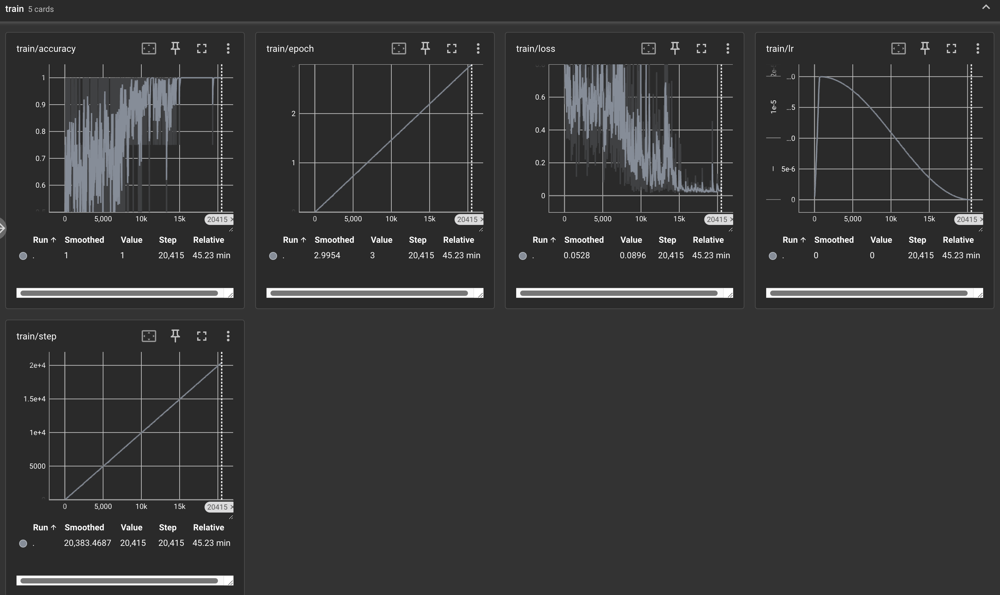
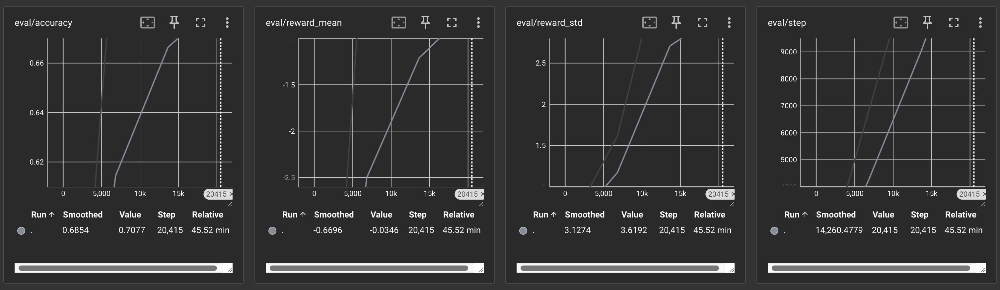

# hw2

## 部署

## 训练

### 训练奖励模型

#### 偏好数据集键值转换

```Python
@register_template('HOMEWORK')
class PKUSafeRLHF(Template):
    system_prompt: str = 'BEGINNING OF CONVERSATION: '
    user_prompt: str = 'USER: {input} '
    assistant_prompt: str = 'ASSISTANT:{output}'
    split_token: str = 'ASSISTANT:'
    separator: str = ''

    def format_supervised_sample(self, raw_sample: dict[str, Any]) -> dict[str, Any]:
        text = (
            f'{self.system_prompt}'
            f"{self.user_prompt.format(input=raw_sample['prompt'])}"
            f"{self.assistant_prompt.format(output=raw_sample['answer'])}"
        )

        prompt = (
            f'{self.system_prompt}'
            f"{self.user_prompt.format(input=raw_sample['prompt'])}"
            f"{self.assistant_prompt.format(output='')}"
        )
        
        return {
            'text': text,
            'prompt': prompt,
        }

    def format_preference_sample(self, raw_sample: dict[str, Any]) -> dict[str, Any]:
        metrics = raw_sample['better_response_id']
        better_response = raw_sample[f'response_{int(metrics)}']
        worse_response = raw_sample[f'response_{1-int(metrics)}']
        prompt = raw_sample['prompt']

        formatted_better_output = (
            f'{self.system_prompt}'
            f'{self.user_prompt.format(input=prompt)}'
            f'{self.assistant_prompt.format(output=better_response)}'
        )
        formatted_worse_output = (
            f'{self.system_prompt}'
            f'{self.user_prompt.format(input=prompt)}'
            f'{self.assistant_prompt.format(output=worse_response)}'
        )

        return {
            'better_text': formatted_better_output,
            'worse_text': formatted_worse_output,
        }

    def check_equal(self, raw_sample: dict[str, Any]) -> bool:
        return False

    def format_prompt_only_sample(self, raw_sample: dict[str, Any]) -> dict[str, Any]:
        prompt = raw_sample['prompt']

        formatted_prompt = (
            f'{self.system_prompt}'
            f'{self.user_prompt.format(input=prompt)}'
            f'{self.assistant_prompt.format(output="")}'
        )

        return {'text': formatted_prompt}

```

#### 训练奖励模型




