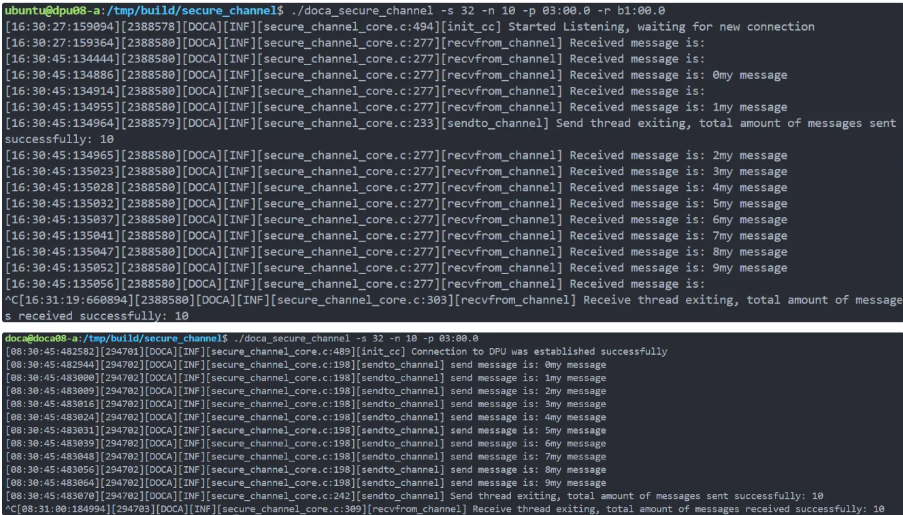
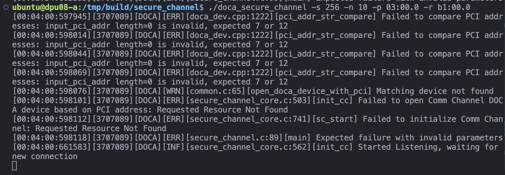
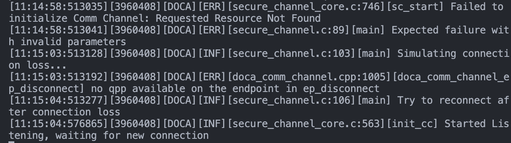

# HW4- DPU 编程

## 修改消息参数与增强日志记录和调试（黄明哲）

### task1 修改消息参数

#### 使用 -s 或 --msg-size 标志尝试不同的消息大小

S==32


S==2048


S==4080

发现：当s>4080时一定会报错，因为我们在secure_channel_core.c中定义了CC_MAX_MSG_SIZE=4080，但是在s<32时并没有。

#### 改变使用 -n 或 --num-msgs 标志发送的消息数

N==1


同时修改双方的N


### task2 增强日志记录和调试

#### 调整Log级别

使用最高的L=70


#### 添加printf来显示详细信息

DPU端：


HOST端：


可以看到，用"Connection has been established"来表示连接成功。
用"Received message"来表示收到消息。
用"Sent message"来表示发送消息。
用"START TIME"和"END TIME"来表示发送和接收的时间。

## JSON配置实现（陈嘉炜）

### task3 JSON配置实现

#### 参数解析与通道注册

- 解析命令行参数，查找是否指定了 --json 选项，并提取 JSON 文件路径。

    ```c
    // Parse command line arguments to get JSON file path
    for (int i = 1; i < argc; i++) {
        if (strcmp(argv[i], "--json") == 0 && i + 1 < argc) {
            json_file = argv[i + 1];
            break;
        }
    }
    ```

- 代码初始化命令行参数解析并注册安全通道的配置参数。

    ```c
    result = register_secure_channel_params(&app_cfg, json_file);
    ```

#### JSON解析逻辑

- 解析指定的 JSON 文件。检查是否提供了 JSON 文件路径，并尝试解析该文件。如果解析失败，记录错误并返回。

    ```c
    // JSON file parsing logic
    if (json_file) {
        struct json_object *parsed_json;
        struct json_object *doca_program_flags;
        struct json_object *msg_size;
        struct json_object *num_msgs;
        struct json_object *pci_addr;
        struct json_object *rep_pci;

        parsed_json = json_object_from_file(json_file);
        if (!parsed_json) {
            DOCA_LOG_ERR("Failed to parse JSON file: %s", json_file);
            return DOCA_ERROR_INVALID_VALUE;
        }
    ```

- 提取和设置 doca_program_flags 下的配置项。从 JSON 中提取特定的配置项，如 msg-size、num-msgs、pci-addr 和 rep-pci，并将其值存储到 app_cfg 结构体中。

    ```c
        json_object_object_get_ex(parsed_json, "doca_program_flags", &doca_program_flags);
    
        if (json_object_object_get_ex(doca_program_flags, "msg-size", &msg_size)) {
            app_cfg->send_msg_size = json_object_get_int(msg_size);
        }
    
        if (json_object_object_get_ex(doca_program_flags, "num-msgs", &num_msgs)) {
            app_cfg->send_msg_nb = json_object_get_int(num_msgs);
        }
    
        if (json_object_object_get_ex(doca_program_flags, "pci-addr", &pci_addr)) {
            strncpy(app_cfg->cc_dev_pci_addr, json_object_get_string(pci_addr), DOCA_DEVINFO_PCI_ADDR_SIZE);
        }
    
        if (json_object_object_get_ex(doca_program_flags, "rep-pci", &rep_pci)) {
            strncpy(app_cfg->cc_dev_rep_pci_addr, json_object_get_string(rep_pci), DOCA_DEVINFO_REP_PCI_ADDR_SIZE);
        }
    ```
- 释放解析后的 JSON 对象内存。

    ```c
    json_object_put(parsed_json);
    ```

测试结果：


## 错误处理与性能分析（张郭熙）

### task5 错误处理

#### 无效参数处理

- 加入了参数验证

    ```c
    if (cfg == NULL || ctx == NULL || dev == NULL || dev_rep == NULL) {
        DOCA_LOG_ERR("Invalid parameters passed to init_cc");
        return DOCA_ERROR_INVALID_VALUE;
    }
    ```

- 在每个关键步骤后添加了错误日志，记录了具体的错误信息，便于后续调试和分析。

    ```c
    DOCA_LOG_ERR("Failed to create Comm Channel endpoint: %s", doca_error_get_descr(result));
    ```

- 资源清理：在发生错误时，确保所有已分配的资源（如互斥锁和设备）都能被正确释放，避免内存泄漏或资源占用。

    ```c
    result = doca_comm_channel_ep_get_event_channel(ctx->ep, &ctx->cc_send_fd, &ctx->cc_recv_fd);
    if (result != DOCA_SUCCESS) {
        DOCA_LOG_ERR("Failed to get event channel: %s", doca_error_get_descr(result));
        close_fd(cc_send_epoll_fd, cc_recv_epoll_fd, send_intr_fd, recv_intr_fd);
        destroy_cc(ctx, dev, dev_rep);
        pthread_mutex_destroy(&cc_mutex);
        return result;
    }
    ```

测试结果：



#### 丢失连接后重连

- 在连接丢失后，能够记录错误日志，然后尝试重新建立连接。

    ```c
    result = sc_start(&app_cfg, &ctx);
    	if (result != DOCA_SUCCESS) {
    		DOCA_LOG_ERR("Failed to initialize endpoint: %s", doca_error_get_descr(result));
    		exit_status = EXIT_FAILURE;
    		// 模拟连接丢失
    		if (ctx.ep != NULL) {
    			DOCA_LOG_INFO("Simulating connection loss...");
    			//doca_comm_channel_ep_disconnect(ctx.ep, ctx.peer);
    			//sleep(1); // 等待断开连接
    			DOCA_LOG_INFO("Try to reconnect after connection loss");
    			result = sc_start(&app_cfg, &ctx); // 尝试重新连接
    			if (result != DOCA_SUCCESS) {
    				DOCA_LOG_ERR("Failed to reconnect after connection loss");
    				exit_status = EXIT_FAILURE;
    
    			}
    		}
    ```

测试结果：



###  task6 性能分析

#### Buffer大小对性能的影响分析

以下是 **Buffer 大小为 64、128、512 和 1024** 时，**发送 100 条 1024 字节消息** 的性能对比表格，并与之前 **发送 10 条 256 字节消息** 的性能进行对比。


 **发送 100 条 1024 字节消息**

| Buffer 大小 | 发送时间 (μs) | 接收时间 (μs) | 总传输时间 (μs) |
| :---------- | :------------ | :------------ | :-------------- |
| **64**      | 3895.488      | 175.563       | 3895.488        |
| **128**     | 3928.405      | 202.159       | 3928.405        |
| **512**     | 4157.321      | 197.115       | 4157.321        |
| **1024**    | 3181.087      | 185.357       | 3181.087        |

 **发送 10 条 256 字节消息 **

| Buffer 大小 | 发送时间 (μs) | 接收时间 (μs) | 总传输时间 (μs) |
| :---------- | :------------ | :------------ | :-------------- |
| **64**      | 118.941       | 131.099       | 504.830         |
| **128**     | 110.051       | 61.327        | 375.832         |
| **512**     | 145.249       | 158.891       | 606.140         |
| **1024**    | 443.854       | 253.776       | 556.452         |

**性能分析**

 **1. 发送时间**

- **发送 100 条 1024 字节消息**：
    - **Buffer 1024** 的发送时间最短（`3181.087 μs`），性能最佳。
    - **Buffer 512** 的发送时间最长（`4157.321 μs`），性能最差。
    - 较大的 Buffer（1024）在发送大数据量时表现更好，可能是因为减少了分片和重组开销。
- **发送 10 条 256 字节消息**：
    - **Buffer 128** 的发送时间最短（`110.051 μs`），性能最佳。
    - **Buffer 1024** 的发送时间最长（`443.854 μs`），性能最差。
    - 较小的 Buffer（64 和 128）在发送小数据量时表现更好。

**2. 接收时间**

- **发送 100 条 1024 字节消息**：
    - **Buffer 64** 的接收时间最短（`175.563 μs`），性能最佳。
    - **Buffer 128** 的接收时间最长（`202.159 μs`），性能最差。
    - 接收时间差异较小，可能是因为接收端的处理逻辑对 Buffer 大小的敏感度较低。
- **发送 10 条 256 字节消息**：
    - **Buffer 128** 的接收时间最短（`61.327 μs`），性能最佳。
    - **Buffer 512** 的接收时间最长（`158.891 μs`），性能最差。
    - 较小的 Buffer（64 和 128）在接收小数据量时表现更好。

 **3. 总传输时间**

- **发送 100 条 1024 字节消息**：
    - **Buffer 1024** 的总传输时间最短（`3181.087 μs`），性能最佳。
    - **Buffer 512** 的总传输时间最长（`4157.321 μs`），性能最差。
    - 较大的 Buffer（1024）在传输大数据量时表现更好。
- **发送 10 条 256 字节消息**：
    - **Buffer 128** 的总传输时间最短（`375.832 μs`），性能最佳。
    - **Buffer 512** 的总传输时间最长（`606.140 μs`），性能最差。
    - 较小的 Buffer（64 和 128）在传输小数据量时表现更好。

 **总结**

1. **Buffer 大小与数据量的关系**：
    - 较小的 Buffer（64 和 128）适合小数据量、高频率的传输场景。
    - 较大的 Buffer（512 和 1024）适合大数据量、低频率的传输场景。
2. **最佳性能**：
    - **发送 10 条 256 字节消息**：**Buffer 128** 表现最佳。
    - **发送 100 条 1024 字节消息**：**Buffer 1024** 表现最佳。
3. **性能趋势**：
    - 随着 Buffer 大小的增加，发送大数据量的性能逐渐提升。
    - 随着 Buffer 大小的增加，发送小数据量的性能逐渐下降。
