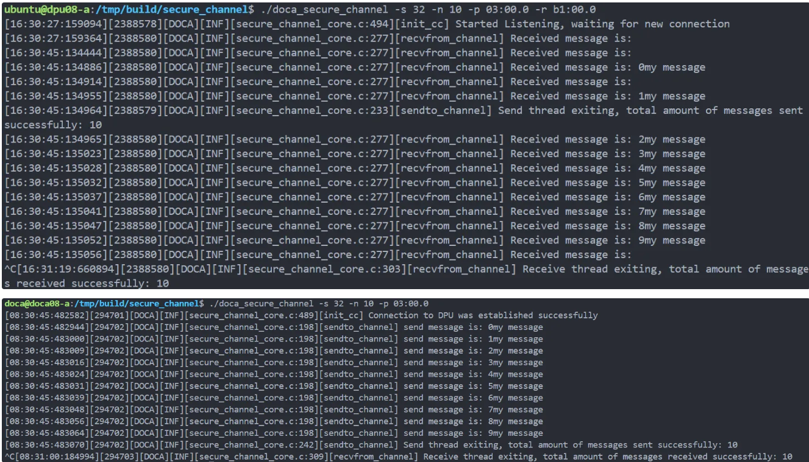
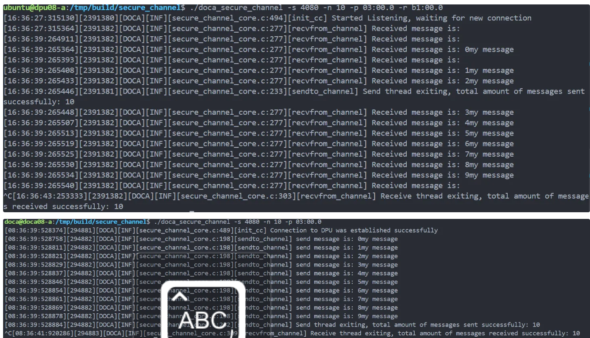
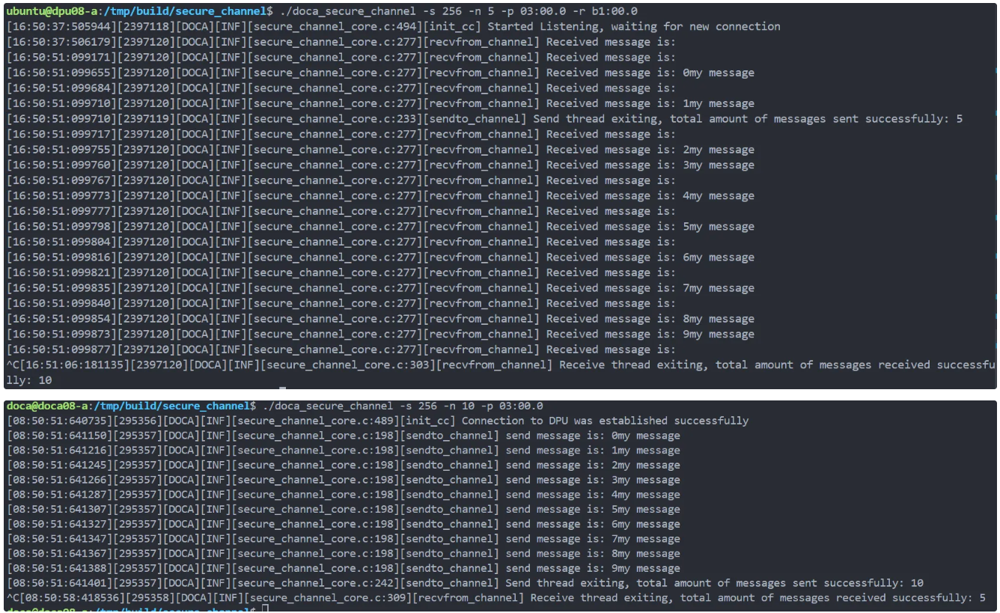
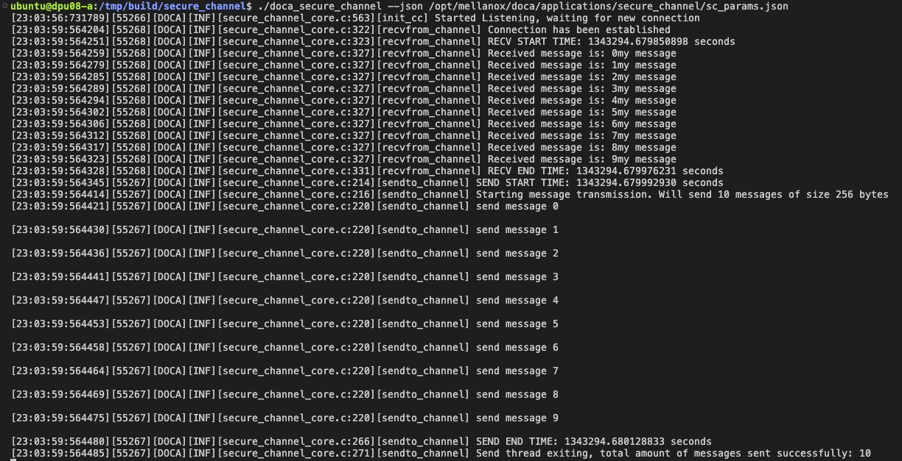
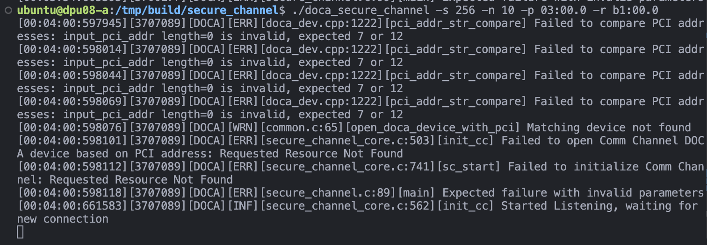
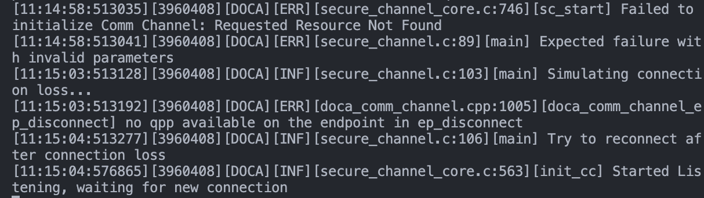

 **基础实现**[^1]

项目的基础运行截图如下：

实现功能：dpu端和host端分别启动，完成消息发送

**新功能设计与实现**

**修改消息参数与增强日志记录（黄明哲）**

- **消息参数修改测试**

| 参数类型 | 测试结果 |
|---------|----------|
| 消息大小(s) |  |
| 消息数量(n) |  |

发现：当s>4080时会报错，因为CC_MAX_MSG_SIZE=4080。

- **日志记录增强**

| 端点 | 日志输出示例 |
|------|-------------|
| DPU & HOST |  |

添加了连接建立、消息收发、时间戳等关键信息的日志记录。

**JSON配置实现（陈嘉炜）**

实现了通过JSON文件配置参数的功能，支持msg-size、num-msgs、pci-addr等参数配置。

测试结果：

**错误处理与性能分析（张郭熙）**

- 错误处理增强：增加了参数验证、错误日志记录和资源清理机制。实现了连接丢失后的重连功能。

| 错误类型 | 处理效果 |
|---------|----------|
| 参数验证 |  |
| 连接重试 |  |

- 性能分析：测试场景：分别测试发送100条1024字节消息和10条256字节消息在不同Buffer大小下的性能。

    - 主要发现：

        - 小数据量传输：Buffer大小128表现最佳

        - 大数据量传输：Buffer大小1024表现最佳

        - Buffer大小与数据量需要匹配才能获得最佳性能

[^1]: *该文档仅为简短说明，完整文档请查阅附件*
